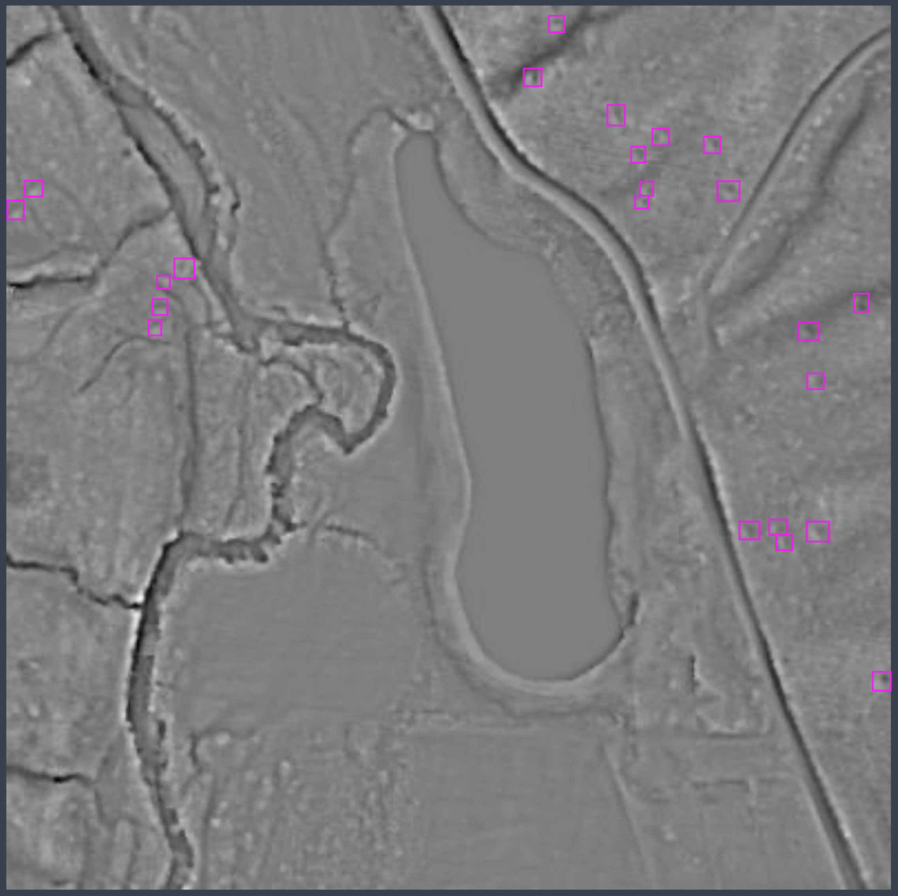

# Tree Throw Detection using YOLOv5

### Read the complete Ultralytics YOLOv5 🚀 documentation [here](https://docs.ultralytics.com/yolov5/).

<p align="center"></p>

Set up the coding environment by following the steps below.
```bash
git clone https://github.com/amanbasu/tree-throw-yolov5.git
pip install -r requirements.txt
```

## Folder structure
```bash
tree-throw-yolov5
├── config-train.json                            # single place to store training script parameters
├── config-inference.json                        # configurations used during inference
├── train.py
├── val.py
├── data                                         # folder to store data used for training/inference
│   ├── dem_files                                # create one folder per run/use-case
│   │   ├── in2017_01251380_12_0_0.tif
│   │   ├── ...
├── models                                       # different model configurations for YOLO
│   ├── yolov5l.yaml
│   ├── yolov5m.yaml
│   ├── yolov5s.yaml
│   ├── ...
├── runs                                         # stores training/inference results of YOLO
│   ├── train
│   │   ├── yolov5
│   │   │   ├── results.csv                      # training history / metric evolution
│   │   │   ├── opt.yaml                         # model hyperparameters and training arguments
│   │   │   ├── weights                               
│   │   │   │   ├── best.pt                      # checkpoint of the best model
│   ├── val
│   │   ├── yolov5
│   │   │   ├── metrics.txt                      # best validation metrics when you test the model
│   │   │   ├── labels                           # all model predictions as txt files
│   │   │   │   ├── in2017_01251380_12_0_0.txt
│   │   │   │   ├── ...
├── scripts                                      # stores all the custom code for tree-throw
│   ├── generate_images.py
│   ├── generate_strided_labels.py
│   ├── rename_labels.py
│   ├── to_yolo_format.py
│   ├── box_to_coords.py
```

## Steps for training and testing YOLOv5

1. [config-train.json](config-train.json): contains the training configurations. <br>
    test_images - provide the images that should belong to the test set, rest of the images are randomly split into training and validation set. <br>
    size - size of each crop that the model can handle (defaults to 400). <br>
    stride - stride size of the crops (defaults to 200). <br>
    image_path - folder path that stores all the images. <br>
    dataset_path - folder path that stores the files for YOLO. <br>
    (Note: please make sure that `dataset_path` doesn't contain 'images' or 'labels' in its absolute path, or it would interfere with [utils/dataloaders.py](utils/dataloaders.py) while reading the images/labels)
2. Label images using Roboflow. <br>
    a. generate high-pass crops from your images and label them using roboflow. <br>
    `python generate_images.py --config config-train.json --save_jpg` <br>
    (save slope or msrm instead of hpass by simply changing the channel index in the code) <br>
    b. upload these images to https://roboflow.com and label them. <br>
    c. export images after labeling and put them in the `labels/` folder under `dataset_path`. <br>
    d. rename label filenames to maintain consistency. <br>
    `python rename_labels.py --config config-train.json` <br>
    (filename changes from *in2017_01251380_12_0_1200_jpg.rf.744492ae1ec8a75db8501c71d139e30d.txt* to *in2017_01251380_12_0_1200.txt*)
3. Prepare data for YOLO. <br>
    a. generate labels for overlapping crops by combining adjacent labels. <br>
    `python generate_strided_labels.py --config config-train.json` <br>
    b. generate tif images to be used as input by the model. <br>
    `python generate_images.py --config config-train.json --train` <br>
    c. convert to a format accepted by YOLO. <br>
    `python to_yolo_format.py --config config-train.json --train` <br>
    (splits the data into train/valid/test sets and prepares them to be used by YOLO) <br>
    Note: This code also prints out a path for the yaml file that you should copy for the next step.
4. Train YOLO. <br>
    a. copy the yaml file path from the previous step. <br>
    b. train YOLO. <br>
    `python train.py --img 400 --batch 64 --epochs 600 --data <yaml-path> --name yolov5 --augment --cache  --weights '' --cfg yolov5m.yaml` <br>
    (change `--data` to the yaml path you copied and `--name` to the folder where you want to save the weights) <br>
    checkout [docs](https://docs.ultralytics.com/yolov5/tutorials/multi_gpu_training/) for multi-gpu training.
5. Test YOLO. <br>
    Run this once the training ends. <br>
    `python val.py --weights runs/train/yolov5/weights/best.pt --data <yaml-path> --img 400 --name yolov5 --save-txt --task test --conf-thres 0.1 --single-cls --save-conf` <br>
    (change `--data` to the yaml path you copied earlier)

Example: <br>
[config-train.json](config-train.json)
```json
{
    "test_images": [
        "in2017_01251385_12", 
        "in2017_01251420_12", 
        "in2017_01251435_12",
        "in2017_01601290_12", 
        "in2017_01601300_12", 
        "in2018_30901370_12"
    ],
    "size": 400,
    "stride": 200,
    "image_path": "data/dem_files/",
    "dataset_path": "dataset-train/"
}
```

[slurm-train.sh](slurm-train.sh)
```bash
#!/bin/bash

cd scripts
python generate_strided_labels.py --config config-train.json
python generate_images.py --config config-train.json --train
python to_yolo_format.py --config config-train.json --train

cd ..
python -m torch.distributed.run --nproc_per_node 4 train.py --img 400 --batch 256 --epochs 600 --data dataset-train/TreeThrow.yaml --name yolov5 --augment --cache --weights '' --cfg yolov5m.yaml --device 0,1,2,3
python val.py --weights runs/train/yolov5/weights/best.pt --data dataset-train/TreeThrow.yaml --img 400 --name yolov5 --save-txt --task test --conf-thres 0.1 --single-cls --save-conf
```

## Steps for inference
Considering that now you have got a trained model, you can use it to predict tree throws.

1. [config-inference.json](config-inference.json): contains the inference configurations.  <br>
    size - size of each crop that the model can handle. <br>
    image_path - folder path that stores all the inference images. <br>
    dataset_path - folder path that stores the files for YOLO.
2. Prepare data for YOLO. <br>
    b. generate tif images to be used as input by the model. <br>
    `python generate_images.py --config config-inference.json` <br>
    c. convert to YOLO format. <br>
    `python to_yolo_format.py --config config-inference.json` <br>
    (prepares test images to be used by YOLO) <br>
    Note: This code also prints out the path for the yaml file that you should copy for the next step.
3. Infer through YOLO. <br>
    `python val.py --weights <model-weight> --data <yaml-path> --img 400 --name <folder-name> --save-txt --task test --conf-thres 0.1 --single-cls --save-conf` <br>
    (change `--data` to the yaml path you copied earlier, `--weights` to the path of the model weights and `--name` to the folder where you want to save the labels) <br>
    The labels will be saved at `runs/val/<folder-name>/labels/`
4. Post-process the labels. <br>
    Consolidate the labels for all the crops and convert relative coordinates to absolute coordinates by using the geo-tagged source file. <br>
    `python box_to_coords.py --config config-inference.json  --one_file` <br>
    (use argument `--save_hpass` to save a geo-referenced hpass image of the source file, use `--one_file` to save all predictions in a single file)

Example: <br>
[config-inference.json](config-inference.json)
```json
{
    "size": 400,
    "image_path": "data/BrownCounty2017/",
    "dataset_path": "dataset-brown-county/",
    "pred_path": "runs/val/brown_county_test/labels",
    "conf_thres": 0.32
}
```

[slurm-val.sh](slurm-val.sh)
```bash
#!/bin/bash

cd scripts
python generate_images.py --config config-inference.json
python to_yolo_format.py --config config-inference.json

cd ..
python val.py --weights runs/train/yolov5/weights/best.pt --data dataset-brown-county/TreeThrow.yaml --img 400 --name brown_county_test --save-txt --task test --conf-thres 0.1 --single-cls --save-conf

cd scripts
python box_to_coords.py --config config-inference.json --one_file
```

## Ultralytics framework insights

### [data/hyps/hyp.tree-throw.yaml](data/hyps/hyp.tree-throw.yaml)
Change model hyperparameters

### [train.py](train.py)
Important script arguments <br>
    `--img`: input image size <br>
    `--batch`: batch size <br>
    `--epochs`: number of epochs for training <br>
    `--cfg`: path to the model configuration file (*yolov5m.yaml* performed the best) <br>
    `--weights`: path to a pre-trained weight file (use `''` to train from scratch) <br>
    `--data`: path to the yaml file used for reading the data <br>
    `--hyp`: path to the hyperparameter file (default to `data/hyps/hyp.tree-throw.yaml`) <br>
    `--resume`: this flag resumes training from the last checkpoint if stopped before the specified number of epochs <br>
    `--evolve`: used for hyperparameter optimization/tuning <br>
    `--cache`: increases the training speed by caching data <br>
    `--optimizer`: select between 'SGD', 'Adam', and 'AdamW' <br>
    `--augment`: use data augmentation while training <br>

### [val.py](val.py)
Important script arguments <br>
    `--weights`: path to the best model weights <br>
    `--data`: path to the yaml file used for reading the data <br>
    `--img`: input image size <br>
    `--save-txt`: use this argument to save predicted labels in txt files <br>
    `--conf-thres`: confidence threshold for predictions, predictions < conf-thres would be ignored <br>
    `--iou-thres`: iou threshold for non-max supression. If two predictions have iou > iou-thres (overlap), the one with lower confidence score would be ignored <br>
    `--single-cls`: treat the problem as a single class problem <br>
    `--save-conf`: save confidence scores with boxes <br>
    `--max-det`: maximum number of detections per image (defaults to 300) <br>

### [models/yolov5m.yaml](models/yolov5m.yaml)
This is the medium sized YOLOv5 model that seemed to work best when trained from scratch. Yolov8 models could not train well when trained from scratch. Therefore, only the pre-trained Yolov8 models are compared below.

| Model             | Precision | Recall    | F1        | mAP50     | mAP50-95  |
|-------------------|-----------|-----------|-----------|-----------|-----------|
| *Yolo5* |
| Yolov5s           |   0.831   |   0.820   |   0.826   |   0.895   |   0.443   |
| Yolov5s (scratch) |   0.839   |   0.815   |   0.827   |   0.902   |   0.446   |
| Yolov5m           |   0.854   |   0.820   |   0.837   |   0.907   |   0.459   |
| Yolov5m (scratch) | **0.855** | **0.830** | **0.843** | **0.910** | **0.461** |
| Yolov5l           |   0.853   |   0.823   |   0.838   |   0.909   |   0.458   |
| Yolov5l (scratch) |   0.853   |   0.822   |   0.837   | **0.910** |   0.459   |
| *Yolov8* |
| Yolov8s           | **0.779** |   0.798   |   0.788   | **0.817** |   0.433   |
| Yolov8m           |   0.774   |   0.801   |   0.787   |   0.815   | **0.434** |
| Yolov8l           |   0.767   |   0.790   |   0.778   |   0.807   |   0.430   |
| Yolov8x           |   0.766   | **0.821** | **0.792** |   0.811   | **0.434** |

### [utils/augmentations.py](utils/augmentations.py)
Augmentations used for training (read more about them here https://albumentations.ai). <br>
  > Blur: prob 0.1 <br>
    ToGray: prob 0.1 (merges all channel data) <br>
    CLAHE: prob 0.1 (applies Contrast Limited Adaptive Histogram Equalization to the image) <br>
    RandomBrightnessContrast: prob 0.1 <br>
    RandomGamma: prob 0.1 <br>
    HorizontalFlip: prob 0.25 <br>
    VerticalFlip: prob 0.25 <br>
    PixelDropout: prob 0.1 (zeros out random pixels) <br>
    RandomRotate90: prob 0.25 <br>
    Sharpen: prob 0.1 <br>
    GaussNoise: prob 0.1 <br>
    ISONoise: prob 0.1 <br>

*Note: no image normalization is done in YOLOv5, however, we normalize all images between 0-255 before saving to tif (check [scripts/generate_images.py](scripts/generate_images.py))*

### [utils/dataloaders.py](utils/dataloaders.py)
1. `read_tif()`: function added to read the tif files. It reads high-pass, slope, and msrm rasters as three separate channels. <br>
2. `img2label_paths()`: reads the images and then tries to find the corresponding label file. If the label file is not found, it is assumed that there are no boxes.
3. `class LoadImagesAndLabels`: loads the images and labels and checks if they are properly formatted. Some of the code has been removed to support tif files. <br>
    `check_cache_ram()`: commented out the code that loads images and checks for the cache size. A constant size of n * 480000 is given. Doesn't affect anything, just avoids unnecessary exceptions. <br>
    `__getitem__()`: commented out `augment_hsv()` as we dont have RGB channels. Flip up-down and left-right is controlled in [utils/augmentations.py](utils/augmentations.py). <br>
    `load_image()`: removed the openCV code that deals with RGB images.
4. `verify_image_label()`: commented out the code that verifies RGB images.

| Input rasters        | Precision | Recall    | F1        | mAP50     | mAP50-95  |
|----------------------|-----------|-----------|-----------|-----------|-----------|
| hpass                |   0.791   |   0.746   |   0.767   |   0.836   |   0.381   |
| slope                |   0.783   |   0.761   |   0.772   |   0.834   |   0.391   |
| msrm                 |   0.731   |   0.711   |   0.721   |   0.766   |   0.317   |
| hpass + slope        |   0.847   |   0.803   |   0.825   |   0.895   |   0.435   |
| slope + msrm         |   0.811   |   0.779   |   0.795   |   0.863   |   0.386   |
| hpass + msrm         |   0.687   |   0.722   |   0.704   |   0.735   |   0.300   |
| hpass + slope + msrm | **0.855** | **0.830** | **0.843** | **0.910** | **0.461** |

This table shows the performance of YOLOv5m model when trained on different input rasters. All models were trained from scratch for 600 epochs with a batch size of 256 and default hyperparameters. To disable a channel, simply replace the values of array with 0 in `read_tif()` function. Example:

```python
# returns only hpass channel
def read_tif(filename):
    # channel 0 - hpass, 1 - slope, 2 - msrm
    im = tifffile.imread(filename)
    im[:, :, 1:] = 0
    return im
```

### [utils/metrics.py](utils/metrics.py)
Contains the `fitness()` function that is used for evaluating the model's performance. The default one works fine for us.

### [utils/loss.py](utils/loss.py)
Contains code for all the loss functions, interesting to see how they are implemented.

[^ Go to top](#tree-throw-detection-using-yolov5)